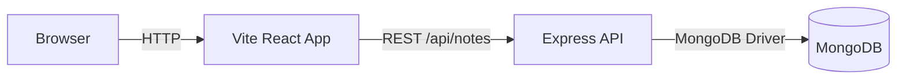

# NoteManagement System — Code Explainer

This document explains how the project is structured, how the backend and frontend work together, and gives concise talking points and likely interview questions with answers.

**Location:** [NOTES_EXPLAINER.md](NOTES_EXPLAINER.md)

## 1. Project Overview

- Purpose: A minimal notes app with a React + Vite frontend and an Express + Mongoose backend.
- Main features: create/update/delete notes, search, pinning, autosave with debounce, two-step delete confirmation.

## 2. High-level Architecture

- Frontend (client): `frontend/` (Vite, React, TypeScript)
- Backend (API): `backend/` (Express, Node.js, Mongoose)
- Database: MongoDB (configured via `MONGODB_URI` in `backend/.env`)

Mermaid diagram (quick mental model):



## 3. Backend — key files and responsibilities

- `backend/src/index.js` — app bootstrap
  - Loads `.env` via `dotenv`.
  - Calls `connectDB()` and starts the server only after the DB connects (safe startup).
  - Attaches middleware: `cors()` and `express.json()`.
  - Mounts routes under `/api/notes`.

- `backend/src/config/db.js` — DB connector
  - Uses Mongoose: `mongoose.connect(process.env.MONGODB_URI)`.
  - On connection failure, logs and exits the process.

- `backend/src/models/Note.js` — Mongoose schema
  - Fields: `title` (required, maxlength 100), `content`, `tags` (string[]), `isPinned` (boolean), timestamps.
  - Adds a text index on `title` and `content` to support search.

- `backend/src/controllers/noteController.js` — request handlers
  - `getNotes(req)`: supports `?search=` query using regex or text search and sorts by `isPinned` then `updatedAt`.
  - `getNoteById(req.params.id)`, `createNote(req.body)`, `updateNote(req.params.id, req.body)`, `deleteNote(req.params.id)`.
  - Returns appropriate HTTP status codes (200, 201, 400, 404, 500) depending on outcome.

- `backend/src/routes/noteRoutes.js` — routes
  - `GET /api/notes` and `POST /api/notes` on `/`
  - `GET|PUT|DELETE /api/notes/:id` on `/:id`

## 4. Backend startup behavior (what changed)

- Previously the server logged `Server running` before the DB connect completed. The bootstrap was updated so `connectDB()` is awaited and `app.listen()` only runs after a successful DB connection. This prevents serving requests when DB is unreachable.

## 5. Frontend — key files and responsibilities

- `frontend/src/main.tsx` — app entry (renders `<App/>`).
- `frontend/src/App.tsx` — main composition
  - Maintains notes list, selectedNoteId, search, loading, error.
  - Uses `useDebounce(search, 500)` to avoid frequent requests.
  - `fetchNotes()` calls `getNotes()` from the API client and updates state.
  - `handleCreateNote`, `handleUpdateNoteInList`, `handleDeleteNoteFromList` manage optimistic UI updates.

- `frontend/src/services/api.ts` — API client
  - Uses `axios`. Base URL is currently hardcoded: `http://localhost:5000/api/notes`.
  - Exposes `getNotes`, `getNoteById`, `createNote`, `updateNote`, `deleteNote`.

- `frontend/src/components/NoteEditor.tsx` — editor logic
  - Local state for title/content/tags/isPinned and autosave logic.
  - Uses `useDebounce` for title/content/tags (1000ms) then `saveNote()` triggers `updateNote()`.
  - Validates title cannot be empty.

- `frontend/src/components/NoteCard.tsx` — list item UI
  - Renders title, preview, pinned icon, delete button, tags and formatted date.

- `frontend/src/components/ConfirmationModal.tsx` — modal
  - Re-usable confirmation modal with two-step confirmation support for destructive actions.

## 6. Data Flow and Example Requests

- To list notes (with optional search):

  curl example:

  ```bash
  curl 'http://localhost:5000/api/notes?search=todo'
  ```

- Create note payload (POST /api/notes):

  ```json
  { "title": "Hello", "content": "Some text", "tags": ["work"], "isPinned": false }
  ```

## 7. Environment & Run Instructions

Backend environment variables (in `backend/.env`):

- `MONGODB_URI` (example in the repo): `mongodb://localhost:27017/notemanagement`
- `PORT` (optional, default 5000)

Commands:

```bash
# Backend
cd backend
npm install
npm run dev   # uses nodemon
npm start     # starts Node

# Frontend
cd frontend
npm install
npm run dev
```

Make sure MongoDB is running and accessible at `MONGODB_URI` before starting the backend.

## 8. Error Handling & Edge Cases

- Backend exits on DB connection failure (safe fail-fast). Controllers wrap operations in try/catch and return appropriate status codes.
- Frontend alerts on create/update/delete failures and shows a toast-like error box when `error` state is set.
- Autosave validates that title is not empty before sending updates.

## 9. Deployment Considerations

- Replace hardcoded `API_URL` with environment-driven config (e.g., `import.meta.env.VITE_API_URL`).
- Add connection pooling, monitoring, and timeouts for production MongoDB.
- Add authentication/authorization for any real deployment (JWT, sessions, rate limits).

## 10. Interview Talking Points (concise)

- Architecture: separation of concerns — API is thin, business logic in controllers, data model in Mongoose.
- Reliability: startup now waits for DB to be ready; fail-fast on DB errors.
- UX: autosave with debounce to reduce network noise; optimistic UI updates for responsiveness.
- Search: currently implemented using regex/text index — discuss pros/cons (regex is flexible but can be slow; text index + Atlas Search improves relevance and scale).
- Data model: simple document per note; tags modeled as array of strings. Consider limiting tags cardinality or normalizing if large-scale metadata is required.
- Scaling: stateless backend can scale horizontally behind a load balancer; MongoDB should be a managed cluster with proper indexes.

## 11. Likely Interview Questions & Short Answers

- Q: Why wait for DB before listening?
  - A: Prevents serving requests that will fail; provides clearer startup guarantees and easier health-checking.

- Q: How does autosave avoid flooding the server?
  - A: Uses debouncing (1000ms in editor) to group edits; only sends when changes stabilize.

- Q: How is search implemented and how to improve it?
  - A: Regex matching + text index. Improve by using MongoDB Atlas Search for relevance, autocomplete, and performance.

- Q: How would you secure this API?
  - A: Add authentication (JWT/OAuth), input validation, rate limiting, CORS origin restrictions, and HTTPS.

- Q: How to handle concurrent updates?
  - A: Use optimistic concurrency (versioning) or server-side locking; Mongoose supports document versioning with `__v`.

## 12. Quick Checklist to Present in Interview

- Explain the request flow from browser → API → DB.
- Point to `backend/src/index.js` for startup sequence and `connectDB()`.
- Show `noteController.js` for CRUD logic and validation.
- Demonstrate frontend autosave in `NoteEditor.tsx` and the API client in `services/api.ts`.
- Mention the change you made (waiting for DB) and why it's safer.

---

If you want, I can also:

- Add a brief Mermaid diagram exported to a PNG.
- Replace the hardcoded frontend API URL with Vite env usage and show the necessary changes.
- Create an `.env.example` and a short README snippet with exact commands.

Tell me which of those you'd like next.
